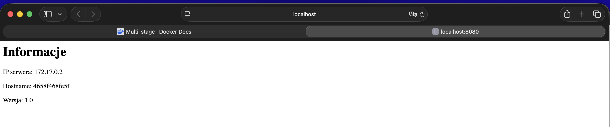

# Laboratorium 6 PAwChO

Robert Horbaczewski

Dockerfile wykorzystujący metodę wieloetapowego budowania obrazów.

Dockerfile:
'''
# STAGE 1

# Budowa obrazu from scratch
# AS build - nazwa nadana etapowi, zgodnie z dobrymi praktykami dla budowania wieloetapowego
FROM scratch AS build

# Uzyty Alpine - lekki system Linux (wersja z zajec)
ADD alpine-minirootfs-3.23.3-aarch64.tar /

# Wersja aplikacji
ARG VERSION=1.0

# Deklaracja katalogu roboczego
WORKDIR /usr/app

# Skrypt do tworzenia HTML. Uruchamiany przy starcie kontenera, aby pobrać informacje o serwerze
RUN echo '#!/bin/sh' > create_html.sh && \
    echo 'echo "<html><body>" > /www/index.html' >> create_html.sh && \
    echo 'echo "<h1>Informacje</h1>" >> /www/index.html' >> create_html.sh && \
    echo 'echo "
IP serwera: $(hostname -i)
" >> /www/index.html' >> create_html.sh && \
    echo 'echo "
Hostname: $(hostname)
" >> /www/index.html' >> create_html.sh && \
    echo 'echo "
Wersja: '"$VERSION"'
" >> /www/index.html' >> create_html.sh && \
    echo 'echo "</body></html>" >> /www/index.html' >> create_html.sh && \
    chmod +x create_html.sh

# STAGE 2

# Uzyty obraz busybox - lzejszy od nginx i wystarczajacy dla malej strony
FROM busybox

# Deklaracja katalogu roboczego
WORKDIR /www

# Kopiuje skryptu z pierwszego etapu do obrazu koncowego
COPY --from=build /usr/app/create_html.sh /create_html.sh

# Informacja o porcie wewnetrznym kontenera, na ktorym nasluchuje aplikacja
EXPOSE 80

# Procedura Healthcheck - zautomatyzowana weryfikacja dzialania uruchomionej aplikacji
HEALTHCHECK --interval=10s --timeout=2s \
  CMD wget -q -O - http://localhost:80 || exit 1

# Domyslne polecenie przy starcie kontenera
CMD sh -c "sh /create_html.sh && httpd -f -p 80 -h /www"
'''

# Budowa obrazu:
(base) roberthorbaczewski@MacBook-Air-M2-Robert Lab5 % docker build -t web777 --build-arg VERSION=1.0 .
[+] Building 1.6s (11/11) FINISHED                                                              docker:desktop-linux
 => [internal] load build definition from Dockerfile                                                            0.0s
 => => transferring dockerfile: 1.67kB                                                                          0.0s
 => [internal] load metadata for docker.io/library/busybox:latest                                               0.8s
 => [internal] load .dockerignore                                                                               0.0s
 => => transferring context: 2B                                                                                 0.0s
 => [internal] load build context                                                                               0.0s
 => => transferring context: 60B                                                                                0.0s
 => [stage-1 1/3] FROM docker.io/library/busybox:latest@sha256:1487d0af5f52b4ba31c7e465126ee2123fe3f2305d638e7  0.6s
 => => resolve docker.io/library/busybox:latest@sha256:1487d0af5f52b4ba31c7e465126ee2123fe3f2305d638e7827681e7  0.0s
 => => sha256:2f3adcef67f09f6a99c349bfbb6ba429e4acd925d86f69bcc51322c096581c17 1.90MB / 1.90MB                  0.6s
 => => extracting sha256:2f3adcef67f09f6a99c349bfbb6ba429e4acd925d86f69bcc51322c096581c17                       0.0s
 => CACHED [build 1/3] ADD alpine-minirootfs-3.23.3-aarch64.tar /                                               0.0s
 => CACHED [build 2/3] WORKDIR /usr/app                                                                         0.0s
 => CACHED [build 3/3] RUN echo '#!/bin/sh' > create_html.sh &&     echo 'echo "<html><body>" > /www/index.htm  0.0s
 => [stage-1 2/3] WORKDIR /www                                                                                  0.0s
 => [stage-1 3/3] COPY --from=build /usr/app/create_html.sh /create_html.sh                                     0.0s
 => exporting to image                                                                                          0.1s
 => => exporting layers                                                                                         0.0s
 => => exporting manifest sha256:a7f6d90972ff5b493cae383b99a39f3e32a131c615a6accb3143b05abf906f84               0.0s
 => => exporting config sha256:a0b7d42ac747f36f3b08fd829d8fd40b21f88374243384964f58cd4d48fe852e                 0.0s
 => => exporting attestation manifest sha256:c2e7ca6bd55ae4b54a8cdb98befe736c6d4bc615b0d2dbb775025c1fc89f398a   0.0s
 => => exporting manifest list sha256:b087e0b07cbd3e835a58f746ccb3bfd12b3f893f38c5a9bbec8c6a149ecb7a77          0.0s
 => => naming to docker.io/library/web777:latest                                                                0.0s
 => => unpacking to docker.io/library/web777:latest                                                             0.0s

 1 warning found (use docker --debug to expand):
 - JSONArgsRecommended: JSON arguments recommended for CMD to prevent unintended behavior related to OS signals (line 46)

View build details: docker-desktop://dashboard/build/desktop-linux/desktop-linux/y809bzlrljthg817qkugbr6dt

# Uruchomienie serwera, sprawdzenie funkcjonowania aplikacji:
(base) roberthorbaczewski@MacBook-Air-M2-Robert Lab5 % docker run -d -p 8080:80 --name web777_test web777  
4658f468fe5f84130854c1f26c9a62969b2d14658ed59f7ed13113d06deea5e6
(base) roberthorbaczewski@MacBook-Air-M2-Robert Lab5 % docker ps
CONTAINER ID   IMAGE     COMMAND                   CREATED          STATUS                    PORTS                                     NAMES
4658f468fe5f   web777    "/bin/sh -c 'sh -c \"…"   57 seconds ago   Up 56 seconds (healthy)   0.0.0.0:8080->80/tcp, [::]:8080->80/tcp   web777_test

# Zrzut ekranu potwierdzający, że aplikacja realizuje wymaganą funkcjonalność:

